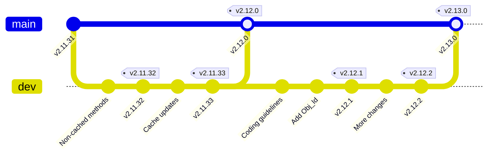

# GitHub Tag Auto-Increment Action

## The Problem

When repositories lack automated version tagging, they become vulnerable to a cascade of version management issues that can significantly impact development efficiency and software reliability. Modern software projects typically maintain their version numbers in multiple locations: Git tags, package manifests, documentation files, and build configurations. Without automation, keeping these various version references synchronized becomes an error-prone manual process.

Version inconsistencies emerge naturally as different team members update different files during the development process. A developer might increment the version in pyproject.toml while preparing a release but forget to update the corresponding README badge. Another team member might create a Git tag that doesn't match the version specified in the package configuration. These discrepancies accumulate over time, leading to a confusing state where the true version of the software becomes unclear.

Release management becomes particularly challenging when version tagging isn't automated. Developers working in parallel might choose conflicting version numbers, or someone might accidentally skip a version number during manual incrementing. Without strict enforcement of semantic versioning rules, version numbers can become irregular and lose their meaning as indicators of compatibility and change significance.

The impact on development workflow is substantial. Teams waste valuable time manually updating version numbers across multiple files, and merge conflicts frequently arise when multiple pull requests attempt to modify version-related files. Developers struggle to determine the latest version in different branches, and tracking which commits correspond to which releases becomes increasingly difficult.

Consider this common scenario encountered in projects without automated versioning:

```bash
# Common problematic scenario before automation
$ git tag         # Shows v1.2.3
$ cat version     # Shows v1.2.4
$ pyproject.toml  # Shows version = "1.2.2"
$ README.md       # Shows badge for v1.2.5
```

These inconsistencies create real operational problems. Deployment pipelines may fail when different systems read versions from different files. Support teams struggle to assist users who can't accurately report which version they're running. Integration becomes problematic when dependent packages can't determine the correct version to target. Development velocity suffers as teams spend time manually reconciling version mismatches instead of delivering features.

### Real-World Example Using Automation

Let's look at how automated versioning works in practice. Here's a real sequence of version updates from a project using this action:

```text
v2.11.31  # Initial version
          # "refactored non-cached methods to Type_Safe__Not_Cached"
          
v2.11.32  # Minor version bump
          # "added get_origin to Type_Safe__Not_Cache"
          # "added misses stats to Type_Save__Cache"
          
v2.11.33  # Minor version bump
          # "wired in more cases of type_safe_cache.get_origin(tp)"
          
v2.12.0   # Major version bump (dev → main merge)
          # "Merge dev into main"
          
v2.12.1   # Minor version bump
          # "improved coding guidelines"
          # "added new helper class Obj_Id"
          
v2.12.2   # Minor version bump
          # Merge commit into dev branch
          
v2.13.0   # Major version bump (current)
          # "Update release badge and version file"
```

In this example, you can see how the version numbers automatically increment according to the type of change:
- Minor changes (bug fixes, small features) increment the patch version (2.11.31 → 2.11.32)
- Major changes (merges to main, significant features) increment the minor version (2.11.33 → 2.12.0)
- All version-related files (README badge, version file, pyproject.toml) stay in sync
- Each version bump is accompanied by meaningful commit messages describing the changes

This automation ensures that versions increment predictably and consistently, while maintaining a clear relationship between version numbers and code changes.

The following diagram shows how these version tags align with the Git branch structure and commits:



This visualization demonstrates several key aspects of the automated versioning:
1. Minor versions (2.11.31 → 2.11.32) occur within the development branch
2. Major versions (2.11.33 → 2.12.0) are created when merging to main
3. Tags are automatically placed on the appropriate commits
4. The version history creates a clear trail of development progress

## Overview

This GitHub Action provides automated semantic versioning tag management for your repository. It supports both minor and major version increments while maintaining synchronized version information across multiple project files.

## Technical Specifications

### Input Parameters

| Parameter | Type | Required | Description |
|-----------|------|----------|-------------|
| release_type | string | Yes | Specifies the type of version increment. Valid values: `major` or `minor` |

### Environmental Dependencies

The action expects the following environment variables to be defined:
- `GIT__BRANCH`: Target branch for version updates
- `PACKAGE_NAME`: Package/project name for version file updates

### Version File Synchronization

The action maintains version consistency across:
1. Git tags
2. README.md badge
3. `/{PACKAGE_NAME}/version` file
4. pyproject.toml

## Implementation Details

### 1. Input Validation
```bash
if [[ "${{ inputs.release_type }}" != "major" && "${{ inputs.release_type }}" != "minor" ]]; then
  echo "Invalid version_change: ${{ inputs.release_type }}. Only 'major' and 'minor' are supported."
  exit 1
fi
```
- Validates release_type against allowed values
- Fails fast on invalid input

### 2. Git Setup and Configuration
```bash
git config --global user.name 'GitHub Actions'
git config --global user.email 'actions@github.com'
git fetch --tags
```
- Configures Git identity for automated commits
- Ensures all tags are available for version calculations

### 3. Version Increment Logic

#### Minor Version Increment
```bash
VERSION_PART=$(echo $LATEST_TAG | sed 's/^v//')
MAJOR=$(echo $VERSION_PART | cut -d. -f1)
MINOR=$(echo $VERSION_PART | cut -d. -f2)
PATCH=$(echo $VERSION_PART | cut -d. -f3)

NEW_PATCH=$((PATCH + 1))
NEW_TAG="v$MAJOR.$MINOR.$NEW_PATCH"
```
Pattern: v{MAJOR}.{MINOR}.{PATCH} → v{MAJOR}.{MINOR}.{PATCH+1}

#### Major Version Increment
```bash
VERSION_PART=$(echo $LATEST_TAG | sed 's/^v//')
MAJOR=$(echo $VERSION_PART | cut -d. -f1)
Z_PART=$(echo $VERSION_PART | cut -d. -f2)

NEW_Z=$((Z_PART + 1))
NEW_TAG="v$MAJOR.$NEW_Z.0"
```
Pattern: v{MAJOR}.{Z}.{PATCH} → v{MAJOR}.{Z+1}.0

### 4. File Updates

#### README Badge Update
```bash
sed -i "s/release-v[0-9]*\.[0-9]*\.[0-9]*/release-$NEW_TAG/" README.md
```
- Updates version badge in README.md
- Uses sed for in-place substitution
- Matches semantic version pattern

#### Version File Update
```bash
echo $NEW_TAG | sed 's/refs\/tags\///' > ./${{ env.PACKAGE_NAME }}/version
```
- Creates/updates version file in package directory
- Strips ref prefix if present

#### pyproject.toml Update
```bash
sed -i "s/\(version[[:space:]]*=[[:space:]]*\)\".*\"/\1\"$NEW_TAG\"/" pyproject.toml
```
- Updates version in pyproject.toml
- Handles variable whitespace in version assignment
- Preserves file formatting

### 5. Version Control Operations

#### Commit Changes
```bash
git add README.md ./${{ env.PACKAGE_NAME }}/version pyproject.toml
git commit -m "Update release badge and version file"
git push origin ${{env.GIT__BRANCH}}
```
- Stages modified files
- Creates version update commit
- Pushes to specified branch

#### Tag Creation
```bash
git tag $NEW_TAG
git push origin $NEW_TAG
```
- Creates new version tag
- Pushes tag to remote

## Usage Examples

### Minor Version Increment
```yaml
- uses: ./.github/actions/increment-tag
  with:
    release_type: 'minor'
```
Example: v1.2.3 → v1.2.4

### Major Version Increment
```yaml
- uses: ./.github/actions/increment-tag
  with:
    release_type: 'major'
```
Example: v1.2.0 → v1.3.0

## Error Handling

The action includes several safeguards:
1. Input validation for release_type
2. Git command error checking
3. File existence verification
4. Version pattern validation

## File Update Patterns

### README Badge
```markdown
Before: 
After:  
```

### Version File
```
Before: v1.2.3
After:  v1.2.4
```

### pyproject.toml
```toml
Before: version = "v1.2.3"
After:  version = "v1.2.4"
```

## Implementation Notes

1. Version Parsing
   - Uses sed/cut for reliable version string manipulation
   - Handles 'v' prefix consistently
   - Supports standard semantic versioning format

2. File Modifications
   - Uses atomic operations where possible
   - Maintains file formatting
   - Preserves non-version content

3. Git Operations
   - Configures Git identity globally
   - Uses explicit branch references
   - Ensures clean working directory

4. Error States
   - Invalid release_type
   - Missing required files
   - Git command failures
   - Version pattern mismatches

This action provides a robust, maintainable solution for automated version management while maintaining consistency across project files.
